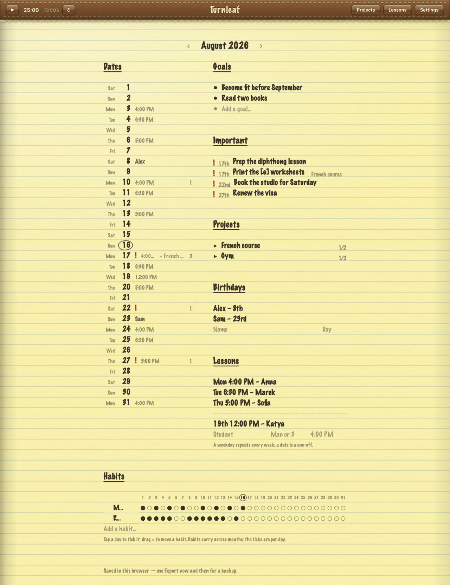
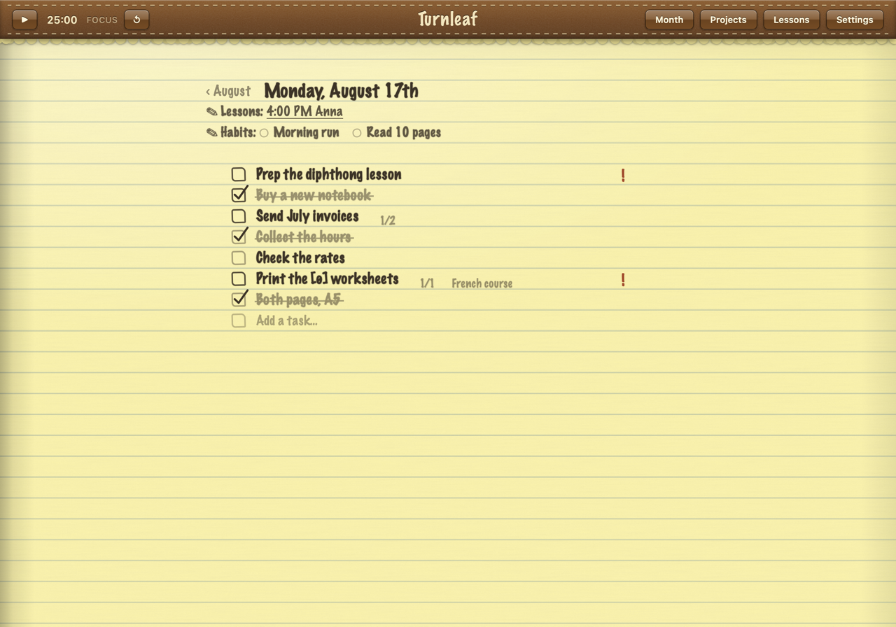
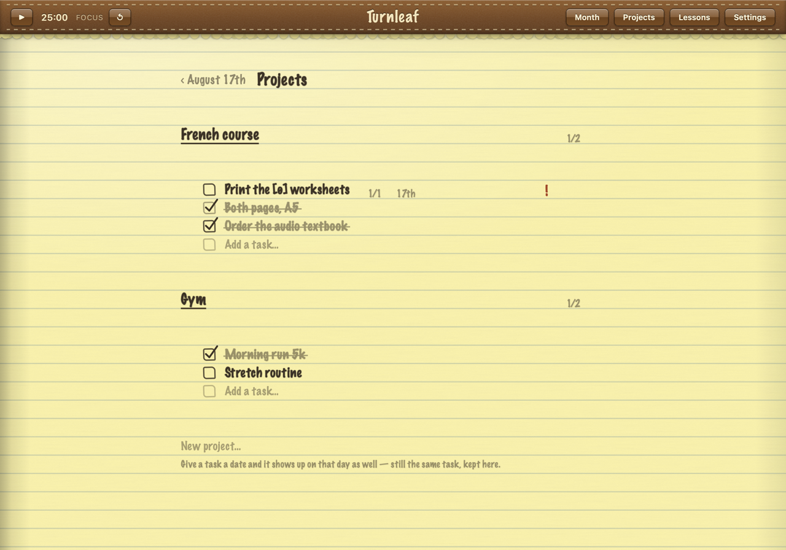

<p align="center"></p>

<h1 align="center">🌿 Turnleaf</h1>

<p align="center">A bullet journal desktop app, styled after the classic leather-and-legal-pad Apple Notes — built with <a href="https://tauri.app">Tauri 2</a> and plain HTML/CSS/JS.</p>

<p align="center">🖥️ Native app · 🔒 No accounts · 📡 No network · 💾 Auto-save</p>

## ✨ What is Turnleaf?

Paper journals pile up friction; big productivity apps are rabbit holes. Turnleaf is the middle path:

- 🖥️ **A real desktop app** — its own window and Dock icon, built on Tauri 2 (a ~10 MB native shell around the same plain HTML/CSS/JS frontend); the window has no title bar — the macOS traffic lights sit inside the leather bar, which doubles as the drag handle
- 🖥️ **Also runs in a browser** — the same frontend works as a plain page for quick previews
- 🔒 **Zero setup, zero accounts** — nothing is fetched, ever; every change auto-saves as you go

## 🚀 Quick start

**Download a release** (no building)

1. Grab the `.dmg` (or `.app`) for your Mac from [Releases](../../releases) — `aarch64` for Apple Silicon, `x64` for Intel
2. The builds are ad-hoc signed (personal use — no paid Apple developer certificate), so macOS blocks the first open. Let it through once, either way:
   - **System Settings → Privacy & Security** → scroll down → **Open Anyway** (right-click → Open no longer exists on modern macOS), or
   - drag the app to `/Applications`, then run `xattr -cr /Applications/Turnleaf.app` in the Terminal

**Download with zero prompts** (Terminal)

Files fetched with `curl` don't get the browser's quarantine flag, so Gatekeeper never bothers you:

```bash
curl -LO https://github.com/FoxBox585/Turnleaf/releases/download/v1.0.2/Turnleaf_1.0.2_aarch64.dmg
open Turnleaf_1.0.2_aarch64.dmg
```

Use `Turnleaf_1.0.2_x64.dmg` on an Intel Mac. Drag Turnleaf into `/Applications` and it just opens.

**Build the desktop app yourself**

1. `cargo tauri build` (or `npm run tauri build`) produces `src-tauri/target/release/bundle/macos/Turnleaf.app` and a `.dmg`
2. Drag it into `/Applications` and double-click

**Preview in a browser** (development)

1. Serve the folder with any static server, e.g. `python3 -m http.server 8777 --directory frontend`
2. Open <http://localhost:8777> — or just open `frontend/index.html` directly (everything works offline; only localStorage persistence is less reliable on `file://` pages in some browsers, so the built app and a served preview are the safe shelves)

**Develop the app**

1. `cargo tauri dev` (or `npm run tauri dev`) — the Tauri CLI serves the frontend itself, so CSS/JS edits appear on ⌘R in the open window

## ✨ Features

### 🗓️ Month spread

The main page mirrors a bullet-journal month spread:

- A *Dates* column (1–31), each day labelled with its weekday (`Mon 1`), with monthly *Goals*, *Birthdays* that recur every year, and *Lessons*
- Today is circled in ink
- Click a date to turn the page — a real 3D page-flip — to that day's to-do list

<p align="center"></p>

### 📄 Day pages

Hand-drawn checkboxes, animated strikethroughs, and in-place editing on every row.

<p align="center"></p>

### 🎂 Lessons & birthdays

One row adds either kind — type a weekday in the middle field (`Mon`) for a lesson that repeats every week, or a date (`19`) for a one-off that month. Times are forgiving on the way in: `4pm`, `1600` and `4:00 PM` all land the same place. Lesson times show against their dates in the *Dates* column and at the top of each day page.

### 📝 Lesson planning

The bar's **Lessons** button lists every weekly lesson and this month's one-offs — click a student's name and their plan page turns over. A plan is that one lesson, on that one date:

- A checklist of plan items — tick, subtask, drag, delete, exactly like a project
- A free-form *Notes* box below, for homework, materials, anything prose-shaped
- Weekly plans open on the next upcoming lesson and the `‹ ›` arrows step a week at a time; every week's plan is kept separately, so you can look back at what you actually did
- On a day page, the lessons line links straight to that day's plan

### 📁 Projects

Folders of tasks that outlive any one month, on their own page:

- Optionally date a task — `20` for a day of the open month, `9/24`, or a full `2027-01-04`; clear the field to un-date it
- A dated task also appears on that day's page and on the spread, labelled with its project
- It is still the one task: tick it on the day and the project agrees

<p align="center"></p>

### ☑️ Subtasks

- The `+` on any task adds a subtask, one level deep
- Ticking the last one ticks the parent; unticking one reopens it; the parent carries a `2/5` counter
- Ticking a parent ticks everything under it
- Counts elsewhere — the number beside a date, a project's tally — count tasks, not subtasks

### 🔁 Habits

A tick table under the month spread: one row per habit, one cell per day of the month. Tap a day to tick it, tap again to untick. The same ticks appear as bubbles on each day page, so either view updates the other — they are the one set of ticks. Habits themselves carry across months, while the ticks are per month, per day.

### ✋ Moving tasks & habits

Grab the `≡` on any task (on a day page or in a project) and drag it to a new place — its subtasks come with it. A dated project task dragged on a day page moves within its own project, since it is still the one task stored there. Habit rows on the month spread have the same `≡` handle: drag to reorder, and each habit's ticks travel with it. `Esc` abandons a drag halfway.

### ⏱️ Timer

A pomodoro on the leather bar: start, pause, reset. Set the focus and break lengths in *Settings*, from the presets or by typing any number of minutes. When a stretch ends it switches over, chimes and waits — it never starts the next one for you. The lengths are saved; the running timer isn't, so reopening the app starts a fresh focus stretch. All navigation happens inside the one window — nothing ever needs a reload — so a running timer survives Projects, Settings and back.

### ⭐ Important

On any day page, the `!` button beside a task lifts it onto the month spread — under *Important*, with its date, and a red `!` on that date's row. Click it to flip straight back to that day. Checking the task off leaves it in the list, struck through, until you unflag it, so the spread is the only page you have to check.

### ⚙️ Settings

A page of its own, from the bar:

- **Show & hide sections** — switch off any part of the month spread you don't want (*Goals*, *Important*, *Birthdays*, *Lessons*, *Projects*, *Habits*) and it disappears, along with its marks in the *Dates* column and on day pages. Nothing is deleted; switching it back on brings it all back
- **Clock** — `4:00 PM`, `16:00`, or follow whatever your computer does. Times are always *stored* as 24-hour, so the setting only changes how they read
- Also holds the **timer lengths** and *About*, with the version and your backups
- *About* also holds **Wipe data**: clear one shelf at a time — day tasks, goals, projects, lessons (with their plans), birthdays, habits (with their ticks) — or everything. Each wipe asks once, downloads a safety backup first, and leaves the rest of the book untouched

## ⌨️ Editing & shortcuts

Every row edits in place — click the part you want to change. On a birthday or a lesson, each piece is its own target: clicking `4:00 PM` opens the time, clicking the name opens the name. Clearing the name deletes the row. Retype a lesson's `Mon` as `19` and it stops repeating weekly and becomes a one-off on the 19th — and back again.

| Key | Action |
| --- | --- |
| `Enter` | add items rapid-fire, or commit an edit |
| `Tab` | move between a row's fields |
| `Esc` | cancel an edit, turn back a page, or abandon a drag |
| `←` / `→` | flip months |
| Click | edit any text; clicking away commits |

## 🧭 Getting around

- The bar's **Projects**, **Lessons** and **Settings** buttons open those pages; the **Month** button (and each page's ‹ back link) brings you home — back-links retrace your actual steps, so no path strands you, and nothing ever needs a page reload
- `Esc` walks back the same way

## 💾 Your data

- 💾 Everything auto-saves to local storage on every change — nothing leaves your machine
- 🌐 The app and each browser each keep their own copy (storage is origin-scoped): Chrome, Safari, and the Turnleaf app are separate shelves. Use **Export** in *Settings → About* for dated JSON backups, and **Import** to restore or migrate — importing safety-exports your current notes first
- ⚠️ In `cargo tauri dev` the window loads the CLI's built-in dev server, a separate origin from any browser preview; the built app has its own storage again
- 🧬 **Moving in from the old single-file build:** in the old version (browser), Export a backup, then Import it in the app — that's the one-time move
- 🗂️ `sample-backup.json` is an example backup — import it to see a filled-in spread
- 🧬 Backups are versioned: older `"version": 1`–`4` files still import cleanly, anything they predate coming back at its default with every section switched on. Exports are now `"version": 5`, and those will **not** open in an older build of Turnleaf

## 🏗️ How it's built

- **Frontend** — `frontend/index.html` + `styles.css` + `app.js`: the whole app in plain vanilla JS, no framework, nothing fetched, ever
- **Shell** — `src-tauri/`: a minimal Tauri 2 project (no plugins, no custom commands) wrapping the frontend in a native macOS window; the icon set is generated from `icon.png` via `cargo tauri icon`
- **Tests** — `npm test` (dev-only: Vitest + jsdom) exercises the pure logic — the reorder engine, parsers, and backup sanitizer — by booting the real app script in a fake DOM; GitHub Actions runs it on every push
- **Releases** — pushing a `v*` tag (e.g. `git tag v1.0.2 && git push origin v1.0.2`) makes GitHub Actions build unsigned `.app`/`.dmg` bundles for both Mac architectures and attach them to a draft GitHub Release, ready to publish

## 📝 Notes

- 🖋️ The handwriting is Marker Felt (a macOS system font); other platforms fall back to Segoe Print / Comic Sans
- ✅ Tested in Chrome and Safari, including the 3D flip via `file://`, and in the Tauri app
- 📦 Textures (SVG noise data-URIs), favicon, and the timer's chime are all inlined — nothing is fetched, ever
- 📐 The layout sits on a 28px baseline grid so the writing lands between the rules rather than through them. Add `#grid` to the URL to see it

## ⚠️ Disclaimer

This project was built iteratively, for personal use, replacing a paper bullet journal. It does exactly what I need and nothing more — maybe you'll find it useful too.
